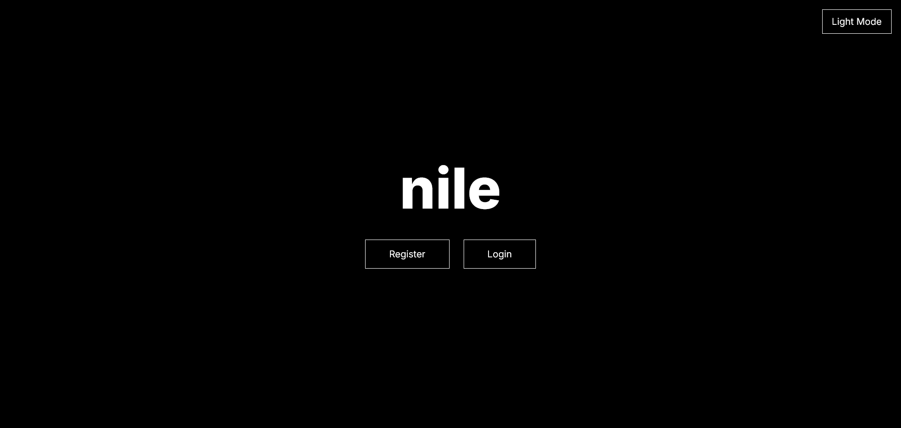
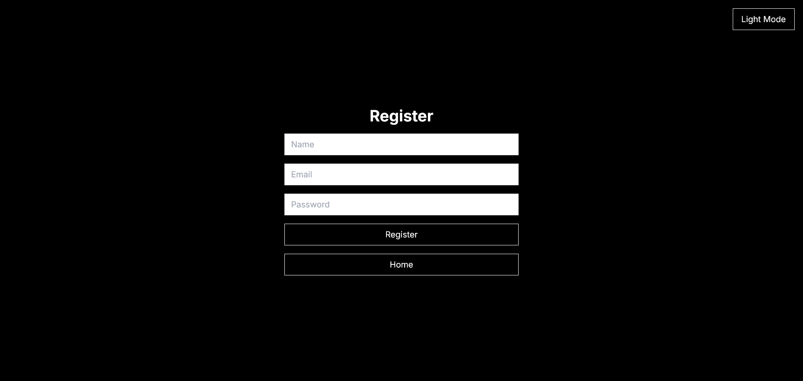
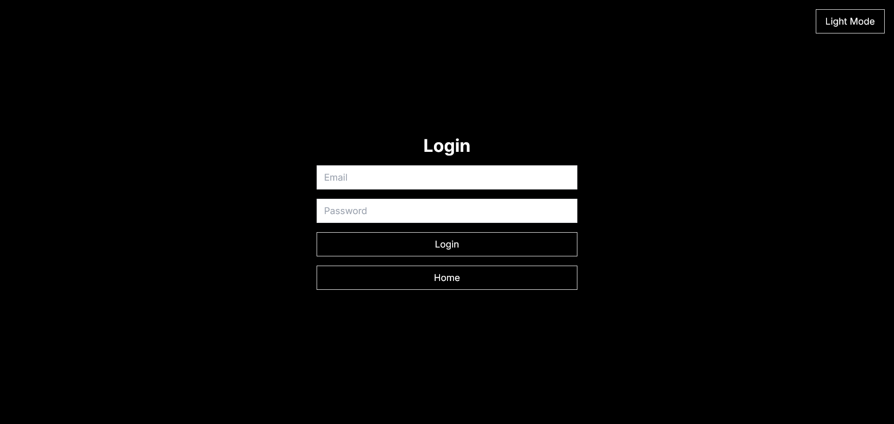
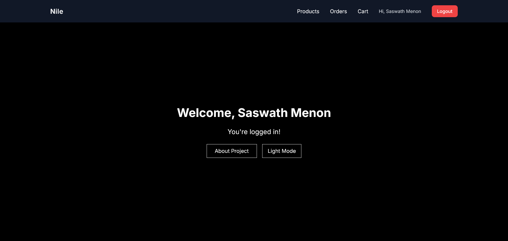

## Nile



Nile is a Spring Boot based e-commerce backend application that provides authentication, user management, product management, cart, and order APIs.
This project demonstrates real-world backend architecture including:

- User registration and login (JWT authentication)
- Role based authorization
- Order processing
- Inventory handling
- Relational database modeling
- Secure REST APIs

The Front-end is being worked on

User registration page:



Login page:



User dashboard:

 

# Running the application

1. Run with docker:

Either create a `.env` file in the same directory as `docker-compose.yaml` which contains
```
JWT_SECRET=supersecretandsecurejwtsecurtykeywhichisatleast32characterslong
```

Or pass it as an environment variable in your current shell

Build and start containers:
```
docker compose down -v
docker compose build --no-cache
docker compose up
```

Services start at http://localhost:8080
MySQL runs in port 3306

2. Run locally with maven:

Make sure MySQL is running on port 3306 with the following parameters:
```
database: nile
username: root
password: root
```

Then export JWT_SECRET in your current shell and run the following commands:
```
mvn clean package
mvn spring-boot:run
```

The app runs at http://localhost:8080

After registering as a user, you will receive a JWT token during subsequent logins. Use it to access protected endpoints

---

# Architecture Overview

This is a monolithic Spring Boot application structured using layered architecture:

Controller -> Service -> Repository -> Database

# Tech Stack

- Java 17
- Spring Boot
- Spring Data JPA
- Spring Security + JWT
- Hibernate
- MySQL 8
- Flyway (if enabled)
- Docker and Docker Compose
- Maven

# Core Modules

- User Domain
- Product Domain
- Cart System
- Order Processing

---

# Development Roadmap

1. Project setup - Done
2. Core domain modeling - Done
3. User & Cart system - Done
4. Service layer implementation - Done
5. REST APIs - Done
6. Flyway migrations - Done
7. Dockerized application - Done
8. Front-end implementation
